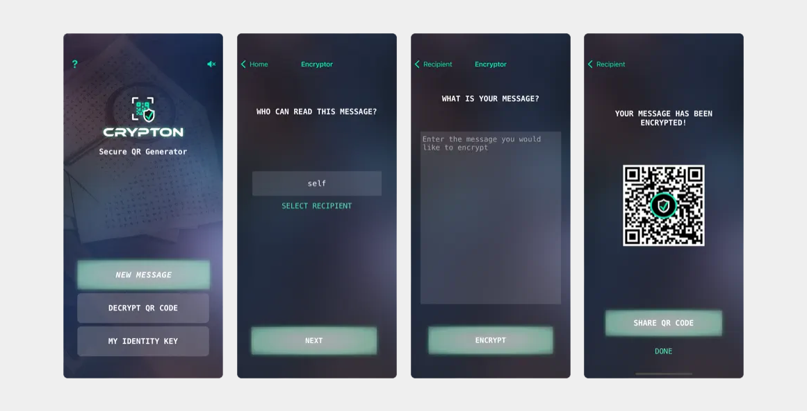

# crypton-ios
 Babbage Message Encryption and Decryption iOS App

## Introduction
The purpose of this app is to illustrate how simple it can be to start building apps using the [Babbage SDK for iOS](https://github.com/p2ppsr/babbage-sdk-ios).

## Features
* Securely log in with your Babbage Identity which is shared across all applications.
* View your MetaNet portal containing your actions, permissions granted, and more.
* Encrypt messages using secure keys derived from your identity key specifically for the Crypton protocol.
* Securely decrypt messages that only you can decrypt.
* You can even encrypt encrypted messages adding several layers of security!

Coming to the iOS App Store soon!